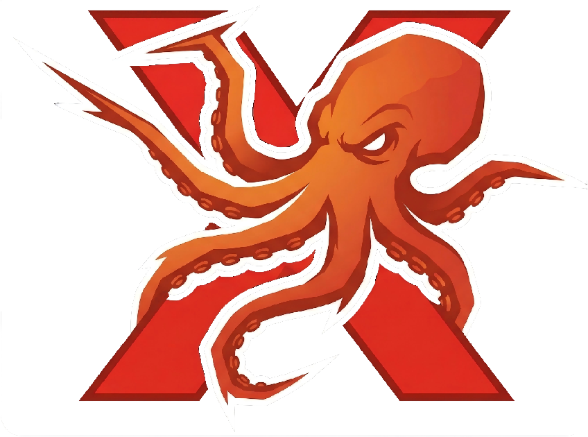
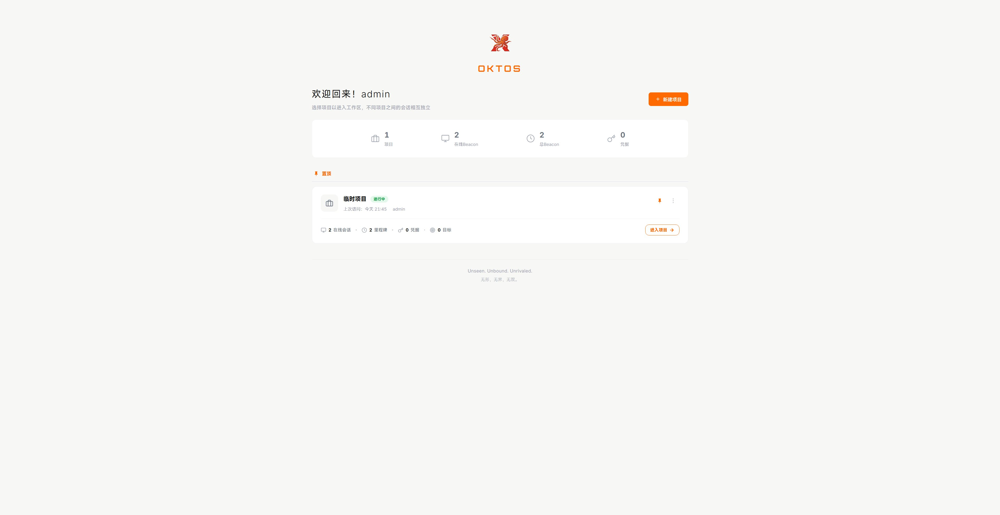
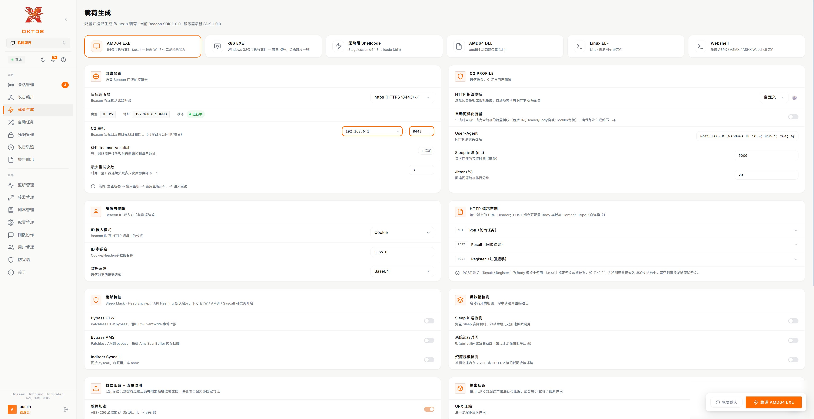
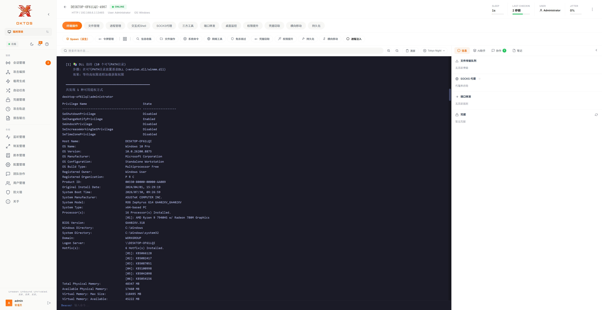
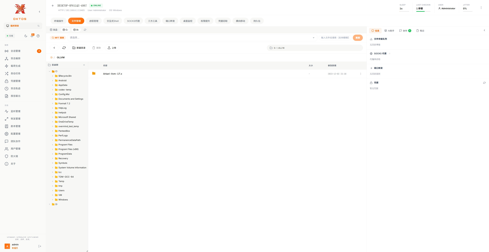
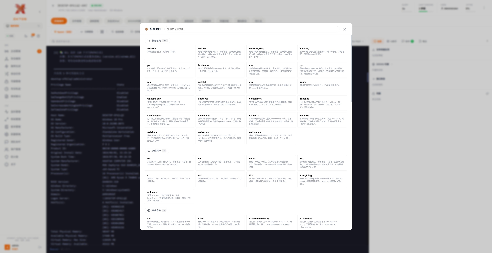
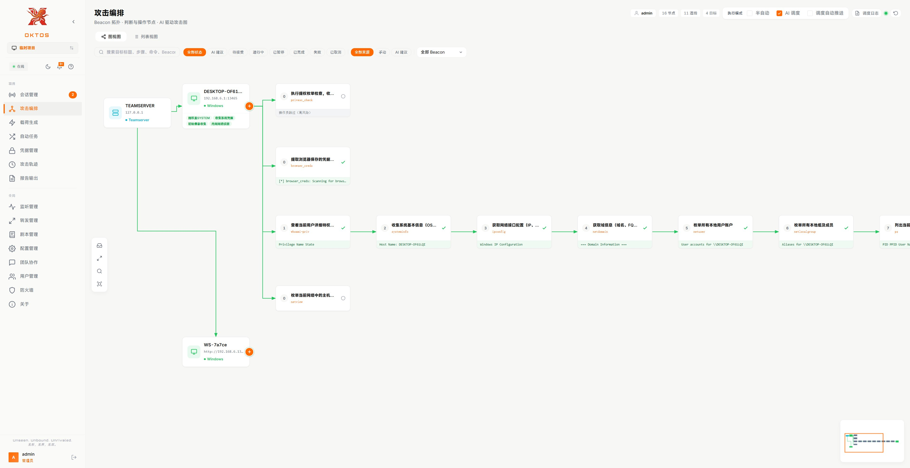
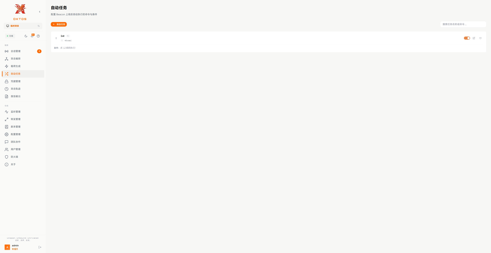
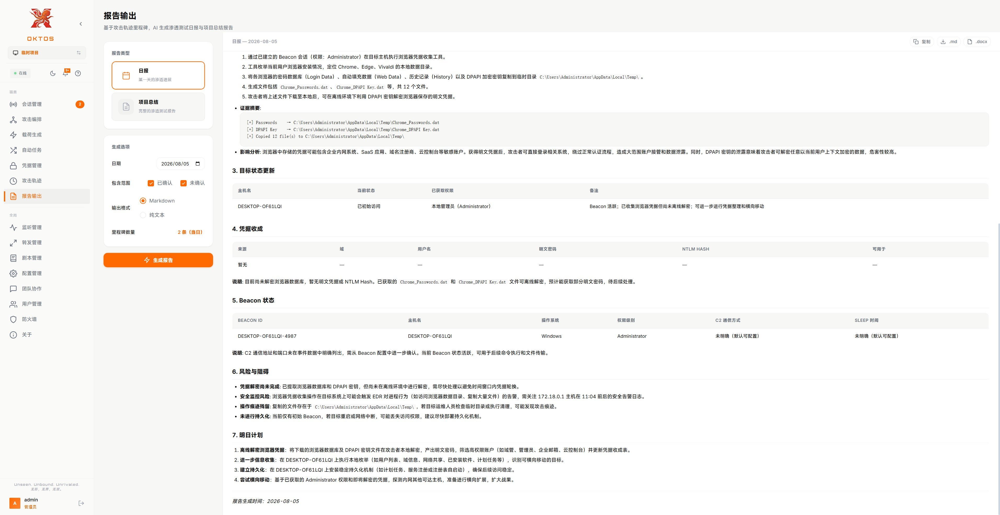

  

<h1 align="center">
  OKTOS
</h1>

  <b>Unseen. Unbound. Unrivaled. // 无形，无界，无双。</b>

 

Oktos 是一款红队后渗透平台，作为 XRED.TEAM 的一部分。它采用了模块化设计，支持 BOF 动态加载、多信道异步通信与内存免杀，内置的 AI 助手可辅助编排或自动执行后渗透任务，为红队提供隐蔽、高效、智能的作战能力。

本项目是完全 Vibe Coding 的，没有一行人类代码。感谢 AI 的蓬勃发展，让我对 C2 的一些设计与想法能够得到快速验证。

注意，本项目是一个没有经过充分 review 和测试的半成品玩具！不要将这个项目用于真实目标，很容易丢失控制权。

你可以在 [release 页面](https://github.com/1y0n/oktos/releases) 获取下载链接，然后在终端/命令提示符中启动 teamserver 即可，默认管理端口是 8080，可通过 --port 参数指定。

如果你发现了 bug （会很常见），欢迎提交 issue（需要写明具体的复现步骤），我将会在未来一段时间内将更多精力投入到 bug 修复和新版本发布中，欢迎随时回来查看。当然，如果有功能或用户体验上的优化建议，也欢迎提交，根据时间酌情修改。

这个项目为经过授权的红队行动设计，不适用于黑灰，拒绝为黑灰提供任何帮助，所有为黑灰、钓鱼、捆绑、定制等提供便利的 issue 都会被忽略，故也无法开源。

因为集成了 mimikatz 等工具，所以 teamserver 本身会被杀软报毒，需将 teamserver 本体添加到杀软白名单。

为避免被捆绑木马，项目内置了简单的防篡改机制，但无法确保100%安全，所以运行前请检查程序的 SHA256 与发布页面是否一致。

第一次启动时会生成配置文件和默认密码，登录管理页面在“用户管理”处修改密码。运行过程中的配置文件未做加密，注意保护。

使用前建议先在“配置管理”中启用 AI ，以解锁全部功能。已测 deepseek-v4-flash，其他的可自测。后期会增加对 MCP 的支持。

知道很多师傅也在借助 AI 开发自己的 C2，欢迎一起沟通交流心得。

如果你想支持这个项目的持续发展，可以考虑加入我的知识星球，顺便解锁更强的免杀能力。星球拒绝黑灰加入，也无法接受定制开发。

以下是一些截图和介绍：

项目管理界面，平台使用“项目”区分不同的会话，不同项目中的会话和一些数据是相互独立的：

  

载荷生成页面，目前支持 Windows（x86, amd64, shellcode）、Linux（amd64）、Webshell（.net）格式：

  

会话详情页面，对于 Windows 会话，默认使用 bof 执行指令，所以大部分命令不会出现子进程，避免基于进程链的检测：

  

  

  

攻击编排页面，将攻击路径可视化，你可以手动设定目标并执行，也可以完全交给 AI 规划和执行：

  

自动任务页面，会话初次回连时，可立即自动执行特定命令，防止会话丢失：

  

报告生成页面，借助 AI 自动生成报告：

  

